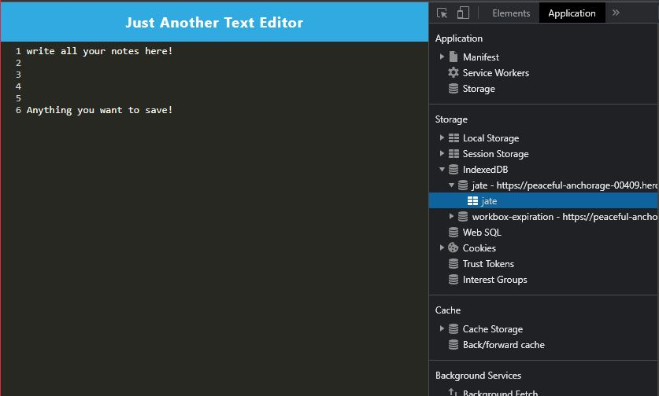

# PWATextEditor

## Description

- A text editor app that can work as a PWA and function even offline!

## Description

- To use application you need to npm install, npm run build.
- To start application type npm run start.
- When you run this file from the terminal it bundles your HTML, CSS, and Javascript service worker and manifest files with webapack plugins.
- When using the app you can type anything into the text editor where it will save in the created indexedDB.
- You can also click install and it will install on your desktop to be used in an offline mode.

## Table of Contents

- [Usage](#usage)
- [Credits](#credits)
- [License](#license)

## Usage

- Heroku URL: https://peaceful-anchorage-00409.herokuapp.com/
- Test Video: https://drive.google.com/file/d/1GqbVw-FGVPFdEizdh0VpYrNF7Aq9jmxk/view?usp=sharing 

## Credits

Heroku
NodeJS
ExpressJS
Javascript

## License

MIT License

Copyright (c) [2022] [Isaac Falcon]

Permission is hereby granted, free of charge, to any person obtaining a copy
of this software and associated documentation files (the "Software"), to deal
in the Software without restriction, including without limitation the rights
to use, copy, modify, merge, publish, distribute, sublicense, and/or sell
copies of the Software, and to permit persons to whom the Software is
furnished to do so, subject to the following conditions:

The above copyright notice and this permission notice shall be included in all
copies or substantial portions of the Software.

THE SOFTWARE IS PROVIDED "AS IS", WITHOUT WARRANTY OF ANY KIND, EXPRESS OR
IMPLIED, INCLUDING BUT NOT LIMITED TO THE WARRANTIES OF MERCHANTABILITY,
FITNESS FOR A PARTICULAR PURPOSE AND NONINFRINGEMENT. IN NO EVENT SHALL THE
AUTHORS OR COPYRIGHT HOLDERS BE LIABLE FOR ANY CLAIM, DAMAGES OR OTHER
LIABILITY, WHETHER IN AN ACTION OF CONTRACT, TORT OR OTHERWISE, ARISING FROM,
OUT OF OR IN CONNECTION WITH THE SOFTWARE OR THE USE OR OTHER DEALINGS IN THE
SOFTWARE.

---

## Badges

